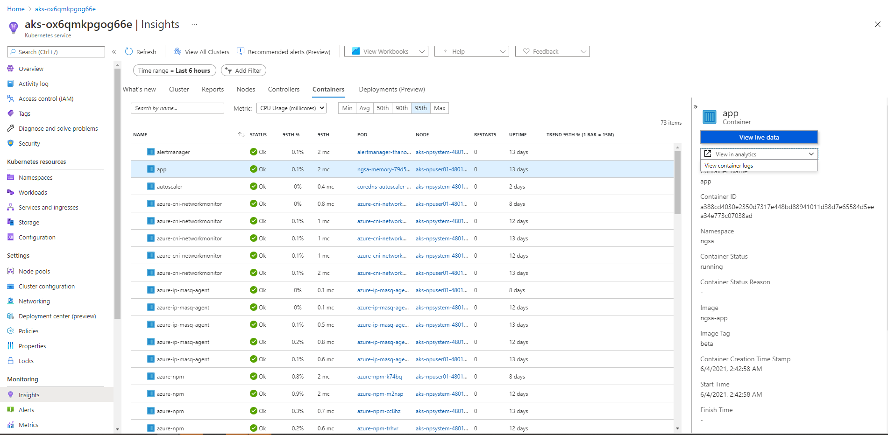

# Deploy Web Validate

## Background

[Web Validate (WebV)](https://github.com/microsoft/webvalidate) is an end-to-end test tool that we will use to generate web API requests against our application. These requests can be validated on a simple returned status code or can be configured to perform a deep validation. Crucially, the logs and metrics of the testing can be stored in Azure Logs and visualized in Grafana to ensure application functionality and performance through integration and load testing. Although not part of this challenge, dashboards and monitors are created from these logs and metrics to gain a real time view of the application along with its historical baseline.

The WebV application needs to be deployed on our AKS cluster. Create a Kubernetes manifest file (yaml) to define and create the appropriate resource(s) needed to deploy WebV. The inputs needed to deploy WebV on our AKS cluster are shown below. Using these inputs, WebV will generate approximately 1 request per second when deployed.

```yaml

namespace:
    ngsa
args:
    --sleep 1000 --run-loop --verbose --log-format Json --server https://${ASB_TEAM_NAME}.aks-sb.com --files memory-benchmark.json

```

### Prerequisite

- This challenge depends on [Challenge 3: Deploying from Azure Container Registry](../azure-container-registry/README.md)
- Load the image `ghcr.io/retaildevcrews/webvalidate:beta` into ACR using same steps you used on challenge 3.

### Validate

After you have deployed the Web Validate tool, you can check WebV pod logs to validate that web API requests are being sent and the correct status codes are being returned. 

The logs can also be viewed in the Azure Portal. Navigate to (your AKS cluster) --> Monitoring --> Insights --> Containers. Select your ngsa-memory pod, then select "View in analytics" --> "View Container Logs". You will be redirected to log analytics, and a custom query for your data will be autogenerated in Log Analytics.



### Bonus Challenge 1

Modify the input arguments to have WebV generate approximately 50 req/sec.

### Bonus Challenge 2

Explore the different ways you could scale WebV to generate more than 1000 req/sec.

#### Hint

There are three possible ways.

## Resources

- [Kubernetes Objects](https://kubernetes.io/docs/concepts/overview/working-with-objects/kubernetes-objects/)
- [Pods](https://kubernetes.io/docs/concepts/workloads/pods/)
- [Kubernetes Cheatsheet](https://kubernetes.io/docs/reference/kubectl/cheatsheet/#creating-objects)

## Hints

### Running WebV from command line

```bash

# pull image from GitHub Container Repository 
docker pull ghcr.io/retaildevcrews/webvalidate:beta

# run WebV with --help option; this should output command line options shown below
docker run ghcr.io/retaildevcrews/webvalidate:beta --help

```

### Sample Interactive WebV Command

More information about running WebV interactively from the command line can be found [here](https://github.com/microsoft/webvalidate).

```bash

# after running this command, you should see json output at the command line describing web API requests

# the WebV command below sends web API requests to the server $ASB_DOMAIN in a continuous loop at the rate of one request per second

# command line arguments:
#   --sleep 1000: 1000ms between web API requests (one request per second)
#   --run-loop: run in a continuous loop
#   --verbose: display verbose results
#   --log-format: format used to display logs; we will be using json format
#   --server $ASB_DOMAIN: test the server $ASB_DOMAIN
#   --files memory-benchmark.json: test file(s) containing web API requests and expected response
#   --duration 10: run in a loop for 10 seconds

docker run -it --rm ghcr.io/retaildevcrews/webvalidate:beta --sleep 1000 --run-loop --verbose --duration 10 --log-format Json --server "https://${ASB_DOMAIN}" --files memory-benchmark.json

```
